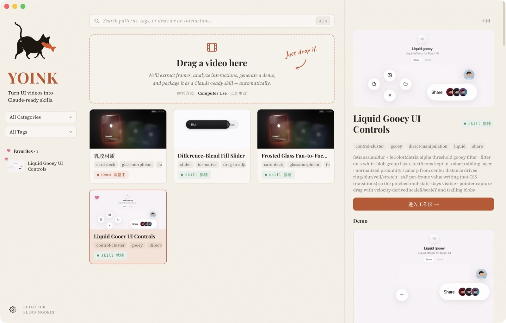
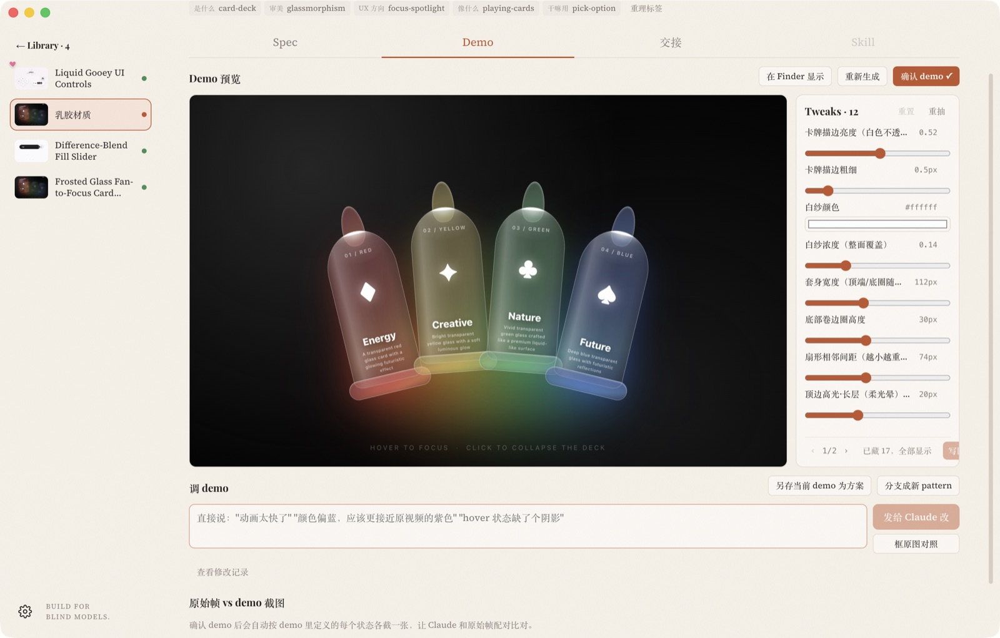

# YOINK

把 UI 交互演示视频变成三样东西：一份核对过的 spec、一个能跑能调的 demo、一个 Claude Code skill。全部在本地，素材库就是一个文件夹。

给两种人用：
- **自己写前端的**：看到别人视频里的效果，拖进来，几分钟后拿到能直接改的 demo 和给 Claude Code 用的 skill。
- **设计师**：复刻只是起点。demo 上有可拖的参数、可分支的方案、一页交接文档，复刻完可以接着自己往下做。





## 跑起来

```bash
brew install ffmpeg        # 抽帧、压视频
npm install
npm start                  # vite + Electron 开发模式
```

需要装好并登录 **Claude Code**（`claude` 命令）。核对、拆材质、生成 demo、改 demo、精简 spec、打包 skill 全部通过 `claude -p` 在本地跑，不用另填 Anthropic key。

视频解析有三种方式，首次拖视频时选：
- **Computer Use**：Claude Code 带 Chrome 扩展，用你已登录的 ChatGPT 网页看视频写 spec。视频会先压到 10MB 以内。
- **API**：填一次 OpenAI key，关键帧发给视觉模型。
- **手动**：自己把视频丢给任何能看视频的模型，把文字粘回来。

Dock 图标上直接丢视频也行。

## 流程

1. **拖视频** → ffmpeg 抽关键帧（场景检测，太平滑则按时长均匀抽）。
2. **原始 spec** → 上面三种方式之一。prompt 要求描述运动而不是数值，并写出"设计意图"和按秒的时序，因为后面核对的模型只能看静止帧。
3. **交叉核对** → Claude 逐帧看图：删脑补、补漏项、修技术方案。设计意图和时序两节原样保留。
4. **材质拆解 + 待判定**（核对完自动接上）→ 你框出主体，Claude 看放大图把表面拆成一层层（形状、位置、软硬、衰减方向、浓淡、叠加方式），写进 spec；同时列出它从静止图判断不了的问题：审美意图、形状、机制二选一、像素归属。你在清单里选答案或自己写。
5. **生成 demo** → 自包含的 `demo/index.html`，960×600，定义 `window.__yoink.states`（每个状态一个函数，用来截图）。你判定过的按决定做，没判定的按第一候选做并留开关。
6. **调 demo**
   - 反馈框直接说"动画太快了"。想指着像素说话就点"框原图对照"，在原始帧上框一块放大附上，Claude 先逐层对比再改。
   - **Tweaks**：demo 里的可调参数是 `<style id="yoink-tweaks">` 里的 CSS 变量，右侧一列滑块实时改、写回文件。抽取时先说你想调什么。形状类参数是 `points` 类型，在 demo 上直接拖角点。不要的参数藏掉。
   - **方案**：另存当前 demo 为方案，每个方案是独立工作区（自己的反馈记录和 tweaks），或者直接分支成新 pattern。侧栏里哪一行有 Claude 在干活，就有条橙色小鱼在游。
7. **确认 demo** → 自动截每个状态、让 Claude 把截图和原始帧配对比对；然后精简 spec：先出一份 diff（被推翻的 / 新发现的 / 用户决定的），再按 diff 重写全文，用户决定单独成节。已有 skill 会自动重打。
8. **交接页** → 从 spec、判定答案、tweaks 清单自动拼出：视频能证明的 / 用户决定的 / 仍未定 / 手感细节 / 可调参数。落盘 `handoff.md`，skill 里带一份。
9. **Skill** → `skill/`（SKILL.md + component/ + spec.md + handoff.md + screenshots/）。

标签固定五个维度，每个最多一个：是什么 / 审美 / UX 方向 / 像什么 / 干嘛用。技术词进 tech_hints。

## 素材库

默认在 `~/yoink/<slug>/`，环境变量 `YOINK_LIBRARY` 可改。每个 pattern 一个文件夹：

```
source.mp4            原视频          demo/index.html       demo
frames/               关键帧          demo-screenshots/     每个状态的截图
material/             材质放大图      demo-compare.md/json  比对报告和配对
raw-spec.md           原始 spec       demo-feedback.md      反馈记录
spec.md               当前 spec       variants/<slug>/      方案（各自 index.html + feedback.md）
spec-verified.md      精简前的长版    judgment.json         待判定清单和答案
consolidate-diff.md   精简时的 diff   handoff.md            交接页
skill/                skill           cover.png / meta.json 封面、元数据
```

## 接到 Claude Code

```bash
claude mcp add --scope user yoink -- node "$(pwd)/mcp/server.mjs"
```

在项目根目录跑。暴露 6 个 tool：`search_patterns`、`get_spec`、`get_frames`、`get_demo_screenshots`、`get_handoff`、`get_skill`。纯文件系统，无网络无鉴权。让 Claude Code 在实现效果前先搜一下库，命中就读 handoff 和 skill。

## 目录

```
electron/         主进程：IPC、流水线各步、yoink:// 协议（带 tweaks bridge）
electron/lib/     ffmpeg / claude CLI / prompts / 素材库读写 / 截图 / 封面裁切
src/              React 界面
shared/types.ts   两边共用的类型
mcp/server.mjs    MCP server
scripts/          开发用的 Electron 壳（自己的 bundle id 和图标，能接 Dock 拖放）
build/            图标
docs/             截图、早期界面草图
```
